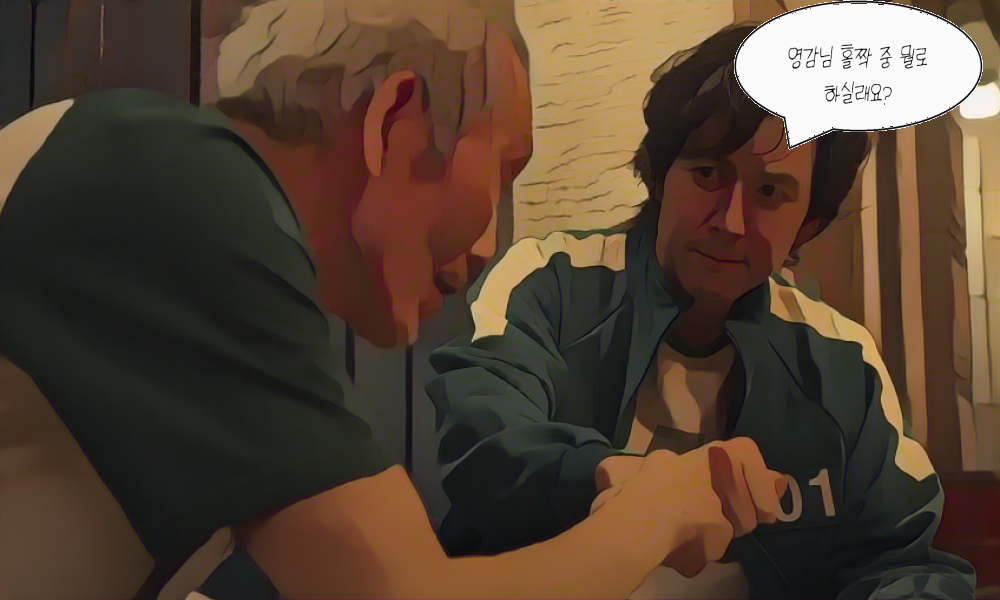
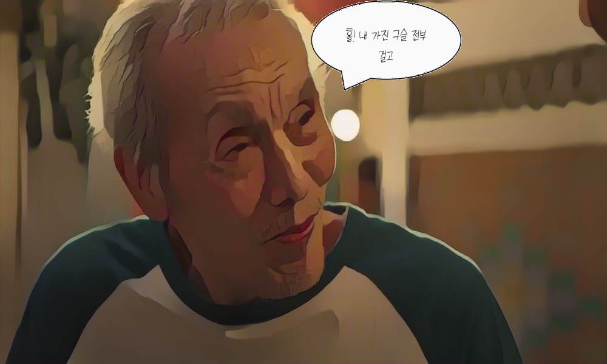
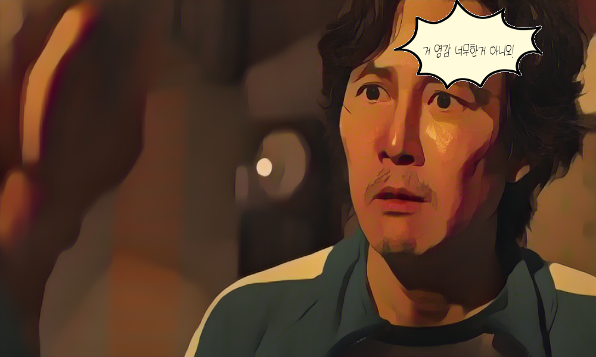
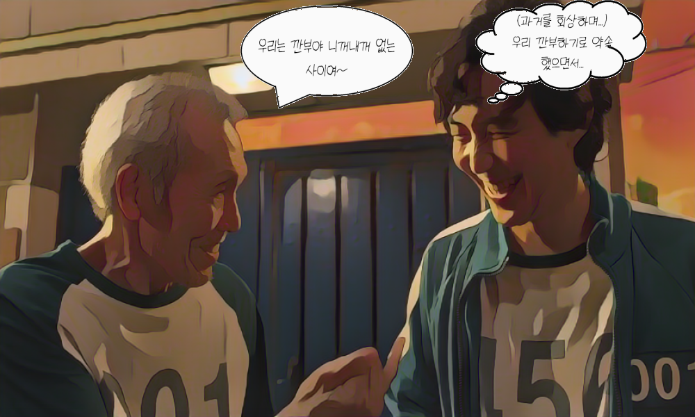
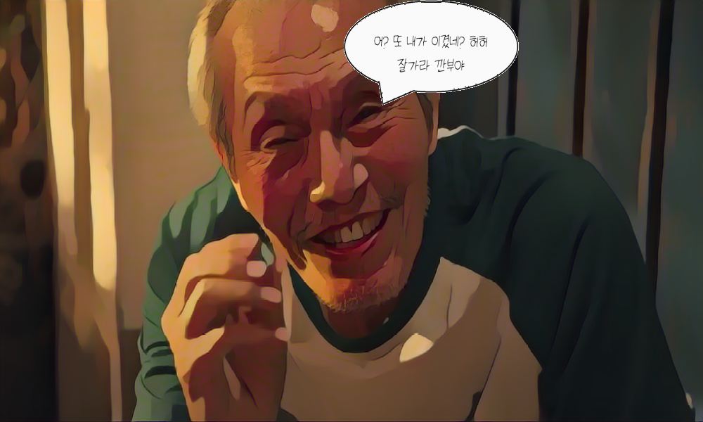

## 결과물!

### 전체 프로젝트 하나로 합치기
실행: 터미널 -> sh demo.sh 입력

### 1. 프로젝트 파일 안으로 들어가기
`cd White-box-Cartoonization/test_code`

### 2. 이미지 만화화하기
`python cartoonize.py`

### 3. 얼굴 위치 찾기 및 말풍선 결합
지금은 수정 중이니 face_detection_copy0에서 돌려주세요!
`python face_detection_copy0.py`   

말풍선 결합이 제대로 돌아가면 face_detection으로 코드를 옮겨주세요~    
코드를 옮긴 후 `python face_detection_copy0.py` -> `python face_detection.py`으로 바꾸면 됩니다!
